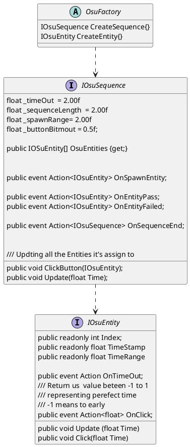
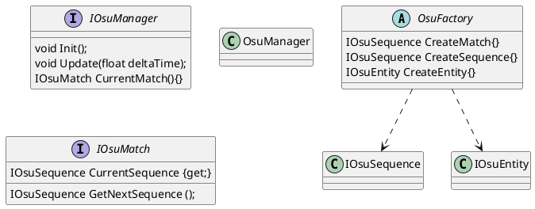

# Architecture 

## Goals

- Split Logic and Implimentation
- Be able to Unit test logic without Unity
- TDD
- Easy & Fast

`OsuSequence`  - is abstract factory for the `OsuButtons` 
`OsuSequence`  - is also updating all it's buttons on Update

## Tests

### Button

- Don't click button
- Click button OnTime
- Click in Range

- Click out of Range(Exception)

#### Sequence

- Spawning first 3 buttons
- Spawning button after first is clicked

- Clicking button in right order
- Clicking button in wrong order

- Complete sequence
- Not complete sequence

## Future Logic

- Rhytm Timing provider
- Health Points
- Unity Integration

## Far future 

- Check design patterns list and maybe add some
