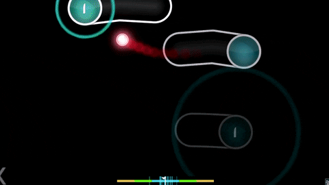

# Osu Money 

The osu game but you use money instead of buttons

## Execution 

- [x] Technical Task
- [ ] Architecture 
- [ ] Tests
- [ ] Logic
- [ ] Unity Integration
- [ ] Visual 
- [ ] Sound
- [ ] Publishing

## Influence 

### Money rain


### Osu Game



## Technical Task

Create Osu like game but with money instead of buttons

### Game play


Difrent money bills appears on the screen. And you need to clik on them in the right order.

> 0.05,0.10,0.25,0.50,1.00$ 2.00$ 5.00$ 10.00$ 20.00$ 50.00$ 100.00$ 500.00$ 1,000.00$.

Money spawns in the spawn range but on the randeom angle on the circle.

And you should click on them in the right sequence otherwise you need to restart the sequnce.

#### Game rhytm

For now we will use some simple static rhytml like `180 bpm`

### HP Drain

### B00bs

### GamePlay itself

```
float _timeOut  = 2.00f
float _sequenceLength  = 2.00f
float _spawnRange= 2.00f
 ```

`timeOut` - how much secons you can wait between button.

## Architecture


